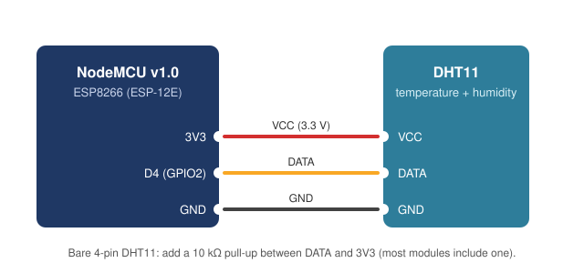

# ESP8266 DHT11 Temperature & Humidity Monitor

**NodeMCU (ESP8266) firmware that reads a DHT11 sensor every two seconds and prints temperature and humidity over serial.**

[](https://github.com/Utkarsh151-glitch/ESP-PROJECT-TEMPREATURE-SENSOR-/actions/workflows/build.yml)


> Hardware project: there is no live demo. A Wokwi simulation is not available because Wokwi does not support the ESP8266.

## Wiring



| DHT11 | NodeMCU |
|---|---|
| VCC | 3V3 |
| DATA | D4 (GPIO2) |
| GND | GND |

📷 _Photo of the build: add one at `docs/photos/build.jpg`._

## Serial output

At 115200 baud the firmware prints a header once, then one line every two seconds. The format comes straight from `src/main.cpp`; the numbers below are example values:

```text
DHT Sensor Reading
Humidity: 56.00 %	Temperature: 29.00 °C
Humidity: 56.00 %	Temperature: 29.00 °C
```

If a reading fails it prints `Failed to read from DHT sensor!` and tries again on the next cycle.

## Features

- Reads temperature (°C) and relative humidity from a DHT11 on pin D4 every 2 s
- Detects failed reads (NaN) and retries instead of printing bad values
- Fahrenheit output is one uncommented line away in `src/main.cpp`; switching to a DHT22 is a one-line change (`DHTTYPE`)

## Tech stack

C++ (Arduino framework) · PlatformIO · Adafruit DHT sensor library · Adafruit Unified Sensor

## Getting started

**PlatformIO** (CLI or the VS Code extension):

```bash
pio run                   # build
pio run -t upload         # flash the NodeMCU over USB
pio device monitor        # open the serial monitor at 115200 baud
```

**Arduino IDE:** install the ESP8266 board package and the two Adafruit libraries above, paste `src/main.cpp` into a new sketch, select *NodeMCU 1.0 (ESP-12E Module)*, and upload.

## Project structure

```text
├── platformio.ini     # board, framework, libraries, monitor speed
├── src/
│   └── main.cpp       # firmware
└── docs/
    ├── wiring.svg     # wiring diagram
    └── photos/        # build photos
```

## Roadmap

- Publish readings over Wi-Fi (a small web page or MQTT); the firmware currently uses serial only
- Optional DHT22 for better accuracy

## Author

Utkarsh Vaibhav · [GitHub](https://github.com/Utkarsh151-glitch) · [LinkedIn](https://www.linkedin.com/in/utkarsh-vaibhav-76aa99300/)
